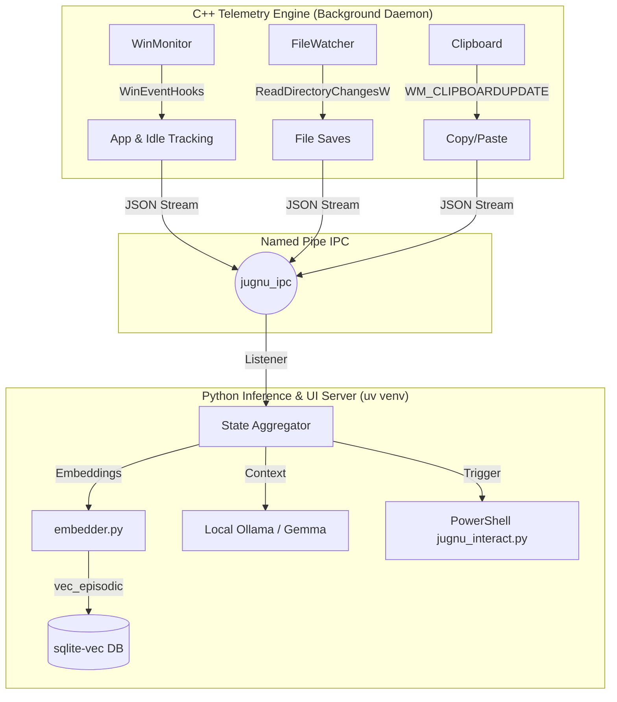

# 🧠 Jugnu — Personalized Study & Coding Buddy for Windows

> A lightweight, always-on AI companion that lives on your Windows laptop, watches what you're doing, remembers your learning journey, and helps you when you need it — completely private, mostly offline. Like a firefly (Jugnu), it doesn't drain your battery but lights up when you're stuck in the dark.

---

## 📌 What Is This?

A **personalized AI agent** that runs natively on Windows. Think of it as a study buddy that:
- **Watches** what you're doing across apps via Win32 OS Hooks (VS Code, Chrome, etc.)
- **Remembers** your study sessions, coding patterns, struggles, and progress using a local Vector Database
- **Helps proactively** — nudges you when stuck via glassmorphic UI cards, surfaces past context, and tracks your placement prep
- **Stays private** — runs 100% offline using local LLMs (Gemma / Ollama)
- **Zero OS Bloat** — A strictly decoupled C++ telemetry engine streams data via Named Pipes to a sandboxed Python UI/AI engine.

---

## 🏗️ Architecture Overview

---

## 🚀 What It Does Right Now (Phase 1.5 Completed)
Jugnu has successfully completed **Phase 1.5: Hybrid Core Integration & Terminal UI**.
- **The C++ GhostWriter**: Deep Win32 hooks actively track Window switching, idle time, and File Saves with zero OS bloat.
- **IPC Telemetry**: A Named Pipe streams JSON payloads from the C++ Kernel into the isolated Python `uv` environment.
- **Semantic RAG Database**: The new `embedder.py` converts code snippets and clipboard text into 384-dimensional vectors using `e5-small-v2`, storing them in `sqlite-vec`.
- **AI Engine (Ollama)**: Automatically connects to a local `gemma4:e2b` model. Employs a custom `_warmup()` routine to bypass CUDA initialization crashes on RTX 4050/Mobile GPUs.
- **Terminal Interaction UI**: When stuck, Jugnu spawns a lightweight, native PowerShell popup window (`jugnu_interact.py`) to query the user for context and deliver insights without blocking the background daemon.

---

## 📅 Development Roadmap (Future Plans)

### Phase 2 — The Brain & RAG Fixes (Current Focus)
- [ ] Fix the `sqlite-vec` UNIQUE constraint bug in `embedder.py` so memory chunks successfully persist into the `vec_episodic` virtual table.
- [ ] Fully wire the RAG search pipeline: connect `embedder.semantic_search()` directly into `state_manager.py`'s AI context window.
- [ ] Upgrade the OS App Prefetching logic (`memory_manager.cpp`) from dummy 4KB reads to full OS Memory Mapping.

### Phase 3 — Persistence Polish
- [ ] Validate the C++ `FlushWorker` background thread to ensure Markov Chains and EMA scores are committed to SQLite every 30 minutes without draining laptop battery.
- [ ] Create a DB reset tool for clean interview demos.

### Phase 4 — Screen Awareness (Far Future)
- [ ] UI Automation Tier 0 (accessibility text reading)
- [ ] CPU Governor: Dynamically throttle CPU priority of "distractor" apps (Discord/Spotify) when Deep Work IDEs are focused.

---

## 🖥️ Hardware Requirements

| Component | Minimum | Recommended Setup |
|---|---|---|
| OS | Windows 10 v1903+ | Windows 11 |
| CPU | Any modern Intel/AMD | Intel i5 13th Gen+ |
| GPU | CPU fallback supported | RTX 4050 6GB (full CUDA offload for `e2b` quantization) |
| RAM | 8GB+ | 16GB LPDDR5X |

---

## 🧩 Tech Stack
- **C++20**: Win32 API, `ReadDirectoryChangesW`, `GetLastInputInfo`
- **Python 3**: `uv` package management, `pywin32`, PowerShell Terminal UI
- **AI/ML**: `ollama` (Gemma4:e2b), `sentence-transformers` (multilingual-e5)
- **Database**: `sqlite3` bundled with `sqlite-vec` extension for unified memory

---
*Built with ❤️ for rapid learning, offline privacy, and hyper-optimized OS telemetry.*
