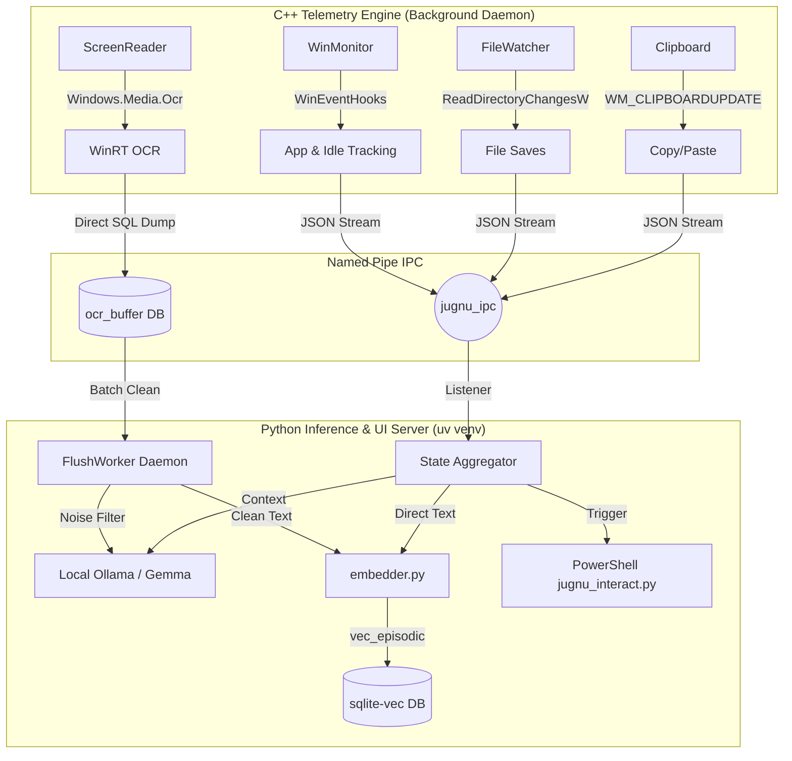

# 🧠 Jugnu — Personalized Study & Coding Buddy for Windows

> A lightweight, always-on AI companion that lives on your Windows laptop, watches what you're doing, remembers your learning journey, and helps you when you need it — completely private, mostly offline. Like a firefly (Jugnu), it doesn't drain your battery but lights up when you're stuck in the dark.

---

## 📌 What Is This?

A **personalized AI agent** that runs natively on Windows. Think of it as a study buddy that:
- **Watches** what you're doing across apps via Win32 OS Hooks (VS Code, Chrome, etc.)
- **Remembers** your study sessions, coding patterns, struggles, and progress using a local Vector Database
- **Helps proactively** — nudges you when stuck via glassmorphic UI cards, surfaces past context, and tracks your placement prep
- **Stays private** — runs 100% offline using local LLMs (Gemma / Ollama)
- **Zero OS Bloat** — A strictly decoupled C++ telemetry engine streams data via Named Pipes to a sandboxed Python UI/AI engine.

---

## 🏗️ Architecture Overview

---

## 🚀 What It Does Right Now (Phase 3 Completed)
Jugnu has successfully completed **Phase 3: Native WinRT Screen Awareness & MSVC Migration**.
- **The C++ GhostWriter**: Deep Win32 hooks actively track Window switching, idle time, and File Saves with zero OS bloat.
- **Native GPU OCR Engine**: Uses MSVC and C++/WinRT to silently capture `BitBlt` screenshots directly into RAM and extract text via `Windows.Media.Ocr` on the GPU, avoiding expensive Python subprocesses.
- **Two-Stage Deferred Processing**: C++ acts as a high-speed Producer dumping raw OCR text into an `ocr_buffer`. A Python `FlushWorker` consumes it every 60s (only on AC power), using Gemma to filter out UI noise before embedding.
- **IPC Telemetry**: A Named Pipe streams JSON payloads (with strict defensive escaping) from the C++ Kernel into the isolated Python `uv` environment.
- **Semantic RAG Database**: The `embedder.py` converts text into 384-dimensional vectors using `e5-small-v2` (featuring an offline fallback network check). It uses a **Snippet + Filepath Hybrid** model to save 10x DB space and always retrieve fresh code from disk.
- **5-Gate Optimization**: RAG pipeline runs through empty checks, quality filters, in-memory throttles, and O(1) DB deduplication before hitting the expensive neural net.
- **AI Engine (Ollama)**: Automatically connects to a local `gemma4:e2b` model. Employs a custom `_warmup()` routine to bypass CUDA initialization crashes on RTX 4050/Mobile GPUs.
- **Terminal Interaction UI**: When stuck, Jugnu spawns a native PowerShell popup window (`jugnu_interact.py`) to query the user, injects top-3 past context from the vector DB, and delivers insights.

---

## 📅 Development Roadmap (Future Plans)

### Phase 3 — Screen Awareness & Native Port (Completed)
- [x] Complete compiler migration from MinGW/GCC to MSVC for WinRT support.
- [x] Build native `Windows.Media.Ocr` pipeline using Win32 GDI captures and `SoftwareBitmap`.
- [x] Handle IPC defensive JSON escaping to prevent unprintable pixels crashing Python.

### Phase 4 — Persistence Polish & CPU Governor
- [ ] Validate the C++ `FlushWorker` background thread to ensure Markov Chains and EMA scores are committed to SQLite every 30 minutes without draining laptop battery.
- [ ] Dynamically throttle CPU priority of "distractor" apps (Discord/Spotify) when Deep Work IDEs are focused.

---

## 🖥️ Hardware Requirements

| Component | Minimum | Recommended Setup |
|---|---|---|
| OS | Windows 10 v1903+ | Windows 11 |
| CPU | Any modern Intel/AMD | Intel i5 13th Gen+ |
| GPU | CPU fallback supported | RTX 4050 6GB (full CUDA offload for `e2b` quantization) |
| RAM | 8GB+ | 16GB LPDDR5X |

---

## 🧩 Tech Stack
- **C++20 (MSVC)**: Win32 API, WinRT, `Windows.Media.Ocr`, `ReadDirectoryChangesW`
- **Python 3**: `uv` package management, `pywin32`, PowerShell Terminal UI
- **AI/ML**: `ollama` (Gemma4:e2b), `sentence-transformers` (multilingual-e5)
- **Database**: `sqlite3` bundled with `sqlite-vec` extension for unified memory

---
*Built with ❤️ for rapid learning, offline privacy, and hyper-optimized OS telemetry.*
