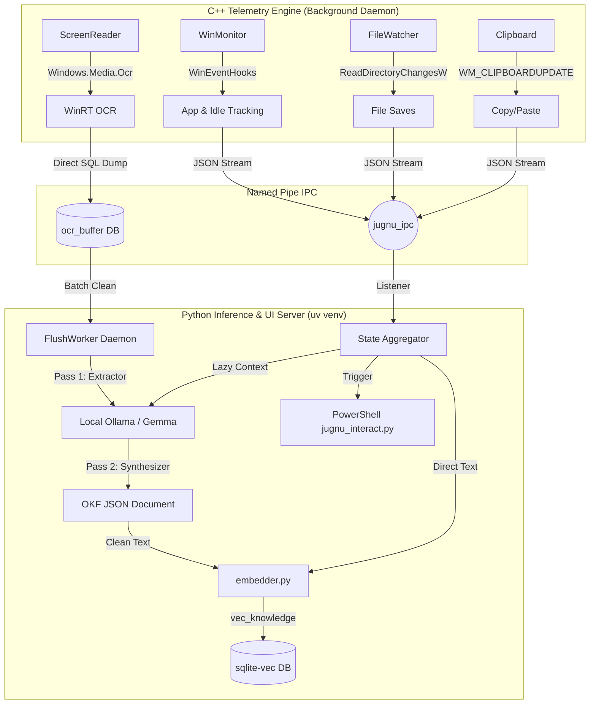

# 🧠 Jugnu — Personalized Study & Coding Buddy for Windows

> A lightweight, always-on AI companion that lives on your Windows laptop, watches what you're doing, remembers your learning journey, and helps you when you need it — completely private, mostly offline. Like a firefly (Jugnu), it doesn't drain your battery but lights up when you're stuck in the dark.

---

## 📌 What Is This?

A **personalized AI agent** that runs natively on Windows. Think of it as a study buddy that:
- **Watches** what you're doing across apps via Win32 OS Hooks (VS Code, Chrome, etc.)
- **Remembers** your study sessions, coding patterns, struggles, and progress using a local Vector Database
- **Helps proactively** — nudges you when stuck via glassmorphic UI cards, surfaces past context, and tracks your placement prep
- **Stays private** — runs 100% offline using local LLMs (Gemma / Ollama)
- **Zero OS Bloat** — A strictly decoupled C++ telemetry engine streams data via Named Pipes to a sandboxed Python UI/AI engine.

---

## 🏗️ Architecture Overview

---

## 🚀 What It Does Right Now (Phase 4 Completed)
Jugnu has successfully completed **Phase 4: Objective Knowledge Format & Lazy RAG Evaluation**.
- **The C++ GhostWriter**: Deep Win32 hooks actively track Window switching, idle time, and File Saves with zero OS bloat.
- **Native GPU OCR Engine**: Uses MSVC and C++/WinRT to silently capture `BitBlt` screenshots directly into RAM and extract text via `Windows.Media.Ocr` on the GPU.
- **Lazy RAG Evaluation**: To save massive amounts of battery, Jugnu no longer generates 500-token answers in the background when you go idle. It performs a hyper-fast (<100ms) vector search and completely defers GPU generation until you explicitly click "Yes" on the UI notification.
- **Battery-Aware Deduplication**: The `FlushWorker` daemon enforces a 30-second screen settle time and uses `difflib.SequenceMatcher`. If your screen hasn't changed by at least 15%, inference is bypassed entirely.
- **Async File Synthesis**: Saving massive 8,000+ line code files pushes synthesis tasks to detached `daemon=True` background threads, preventing C++ IPC buffer overflows.
- **Custom Problem RAG Override**: If the UI pops up based on a Python file, but you type *"Actually, how do I configure Docker?"*, Jugnu instantly discards the old context, dynamically builds a new query, and re-runs semantic search to prevent hallucination.
- **AI Engine (Ollama)**: Automatically connects to a local `gemma4:e2b` model. Employs a 1-token `_warmup()` routine and completely disables Flash Attention to bypass CUDA initialization crashes on RTX 4050 mobile GPUs.

---

## 📚 The Objective Knowledge Format (OKF)

Jugnu leverages a hyper-structured schema inspired by Google's [Objective Knowledge Format (OKF)](https://cloud.google.com/blog/products/data-analytics/how-the-open-knowledge-format-can-improve-data-sharing). Instead of dumping raw, noisy OCR pixels into a vector database, Jugnu executes a **Two-Pass Synthesis Pipeline**:

1. **Pass 1 (Extractor)**: Gemma strictly slices out UI scrollbars, ads, and boilerplate, returning only factual semantic bullet points.
2. **Pass 2 (Synthesizer)**: Gemma structures the clean bullets into a pristine JSON document (`topic`, `content`). 

These synthesized JSON documents are then indexed by `sqlite-vec` into a dual-table `knowledge_docs` and `vec_knowledge` structure. This ensures that when Jugnu searches for context, it retrieves clean, objective knowledge rather than a chaotic jumble of text.

---

## 📅 Development Roadmap (Future Plans)

### Phase 4 — Objective Knowledge Format & Lazy RAG (Completed)
- [x] Complete Two-Pass OKF synthesis for pristine vector embeddings.
- [x] Implement Lazy RAG to defer massive GPU workloads until user confirmation.
- [x] Implement Battery-aware background task deferral (Settle times + `difflib` caching).

### Phase 5 — Native UI & Cloud Escalation
- [ ] Implement Gemini API logic to act as a fallback when the local 4B model lacks confidence.
- [ ] Port the PowerShell terminal UI to a fully native C++ WebView2 borderless window experience.

---

## 🖥️ Hardware Requirements

| Component | Minimum | Recommended Setup |
|---|---|---|
| OS | Windows 10 v1903+ | Windows 11 |
| CPU | Any modern Intel/AMD | Intel i5 13th Gen+ |
| GPU | CPU fallback supported | RTX 4050 6GB (full CUDA offload for `e2b` quantization) |
| RAM | 8GB+ | 16GB LPDDR5X |

---

## 🧩 Tech Stack
- **C++20 (MSVC)**: Win32 API, WinRT, `Windows.Media.Ocr`, `ReadDirectoryChangesW`
- **Python 3**: `uv` package management, `pywin32`, PowerShell Terminal UI
- **AI/ML**: `ollama` (Gemma4:e2b), `sentence-transformers` (multilingual-e5)
- **Database**: `sqlite3` bundled with `sqlite-vec` extension for unified memory

---
*Built with ❤️ for rapid learning, offline privacy, and hyper-optimized OS telemetry.*
