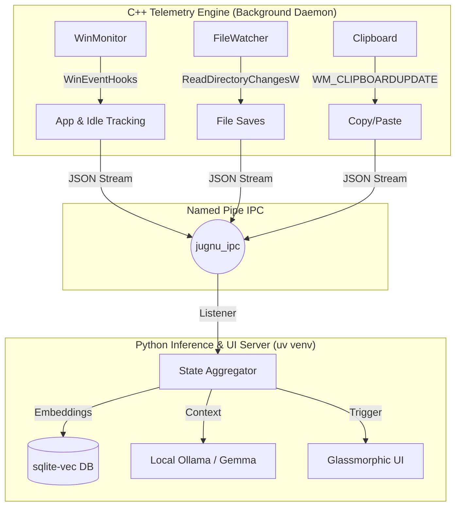

# 🧠 Jugnu — Personalized Study & Coding Buddy for Windows

> A lightweight, always-on AI companion that lives on your Windows laptop, watches what you're doing, remembers your learning journey, and helps you when you need it — completely private, mostly offline. Like a firefly (Jugnu), it doesn't drain your battery but lights up when you're stuck in the dark.

---

## 📌 What Is This?

A **personalized AI agent** that runs natively on Windows. Think of it as a study buddy that:
- **Watches** what you're doing across apps via Win32 OS Hooks (VS Code, Chrome, etc.)
- **Remembers** your study sessions, coding patterns, struggles, and progress using a local Vector Database
- **Helps proactively** — nudges you when stuck via glassmorphic UI cards, surfaces past context, and tracks your placement prep
- **Stays private** — runs 100% offline using local LLMs (Gemma / Ollama)
- **Zero OS Bloat** — A strictly decoupled C++ telemetry engine streams data via Named Pipes to a sandboxed Python UI/AI engine.

---

## 🏗️ Architecture Overview

---

## 🚀 What It Does Right Now (Phase 1 Completed)
Jugnu has successfully completed **Phase 1: Hybrid Core Integration**.
- **The C++ GhostWriter**: Deep Win32 hooks are actively tracking Window switching (filtering out OS noise), determining user idleness (`GetLastInputInfo`), and monitoring File Saves.
- **IPC Telemetry**: A zero-latency Named Pipe streams JSON payloads from the C++ Kernel into the isolated Python `uv` environment.
- **Thread-Safe Reactive UI**: When the user gets "stuck", Python safely spawns a beautiful, frameless `pywebview` Notification Card directly onto the Windows desktop using daemon threads, allowing the user to interact without deadlocking the IPC telemetry loop.

---

## 📅 Development Roadmap (Future Plans)

### Phase 2 — The Brain (Current Focus)
- [ ] Install `sqlite-vec` to unify Markov Chain persistence with semantic Vector Embeddings.
- [ ] Integrate `sentence-transformers` running the `multilingual-e5` model to embed code files and clipboard history.
- [ ] Fully wire the C++ `clipboard_manager.cpp` into the IPC pipeline.
- [ ] Upgrade the OS App Prefetching logic (`memory_manager.cpp`) from dummy 4KB reads to full OS Memory Mapping.

### Phase 3 — Screen Awareness & Deep Work
- [ ] UI Automation Tier 0 (accessibility text reading)
- [ ] WGC + Windows OCR Tier 1 (triggered capture on unreadable apps)
- [ ] CPU Governor: Dynamically throttle CPU priority of "distractor" apps (Discord/Spotify) when Deep Work IDEs are focused.

### Phase 4 — Product Polish
- [ ] Migrate `pywebview` interim UI fully into embedded C++ WebView2 to eliminate the Python process requirement.
- [ ] Windows Installer, System Tray icon, and Auto-Start routines.
- [ ] Multi-user placement prep tracking dashboards.

---

## 🖥️ Hardware Requirements

| Component | Minimum | Recommended Setup |
|---|---|---|
| OS | Windows 10 v1903+ | Windows 11 |
| CPU | Any modern Intel/AMD | Intel i5 13th Gen+ |
| GPU | CPU fallback supported | RTX 4050 6GB (full CUDA offload for `e2b` quantization) |
| RAM | 8GB+ | 16GB LPDDR5X |

---

## 🧩 Tech Stack
- **C++20**: Win32 API, `ReadDirectoryChangesW`, `GetLastInputInfo`
- **Python 3**: `uv` package management, `pywebview`, `pywin32`
- **AI/ML**: `ollama` (Gemma4:e2b), `sentence-transformers` (multilingual-e5)
- **Database**: `sqlite3` bundled with `sqlite-vec` extension for unified memory

---
*Built with ❤️ for rapid learning, offline privacy, and hyper-optimized OS telemetry.*
